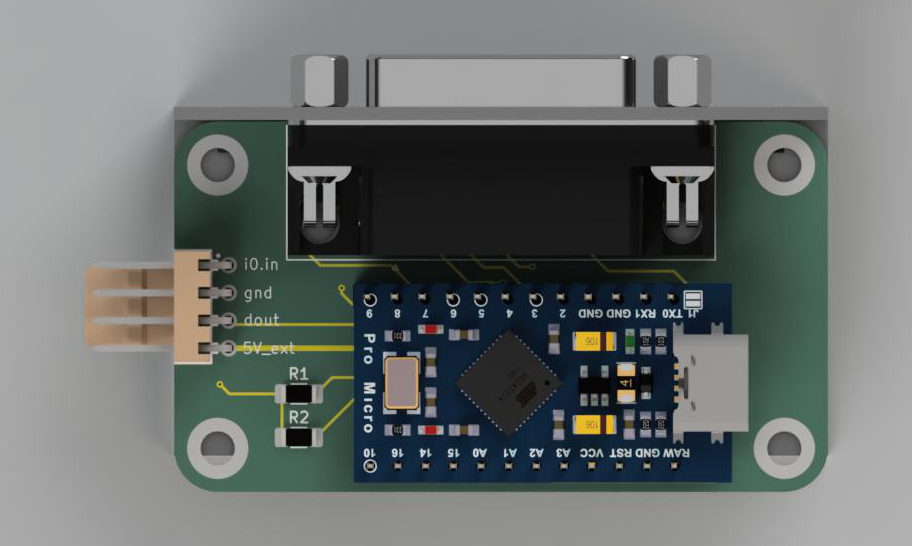
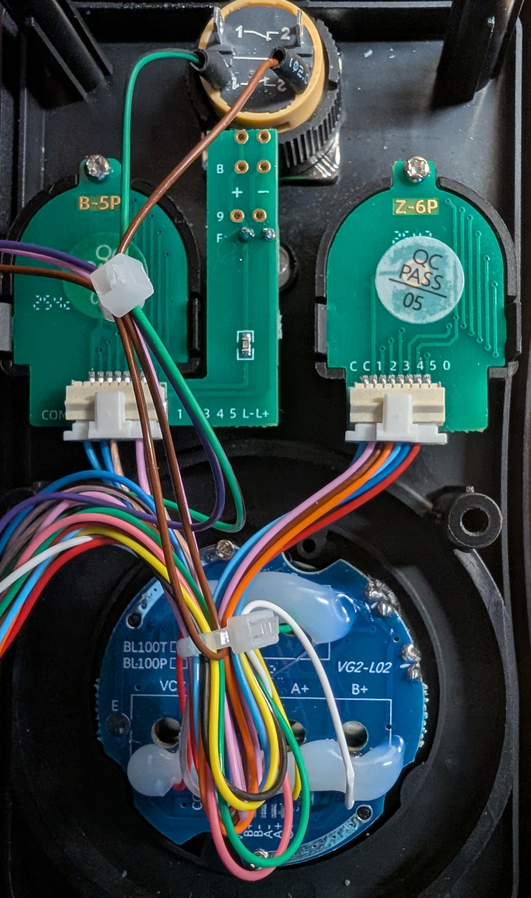
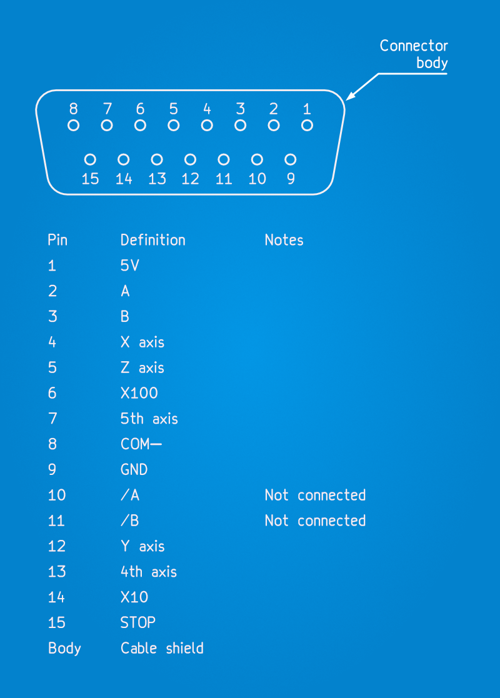
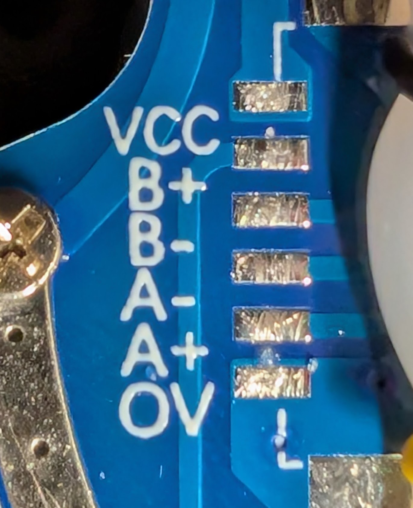
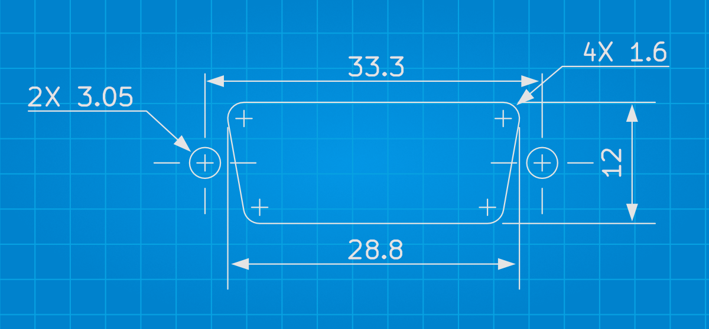
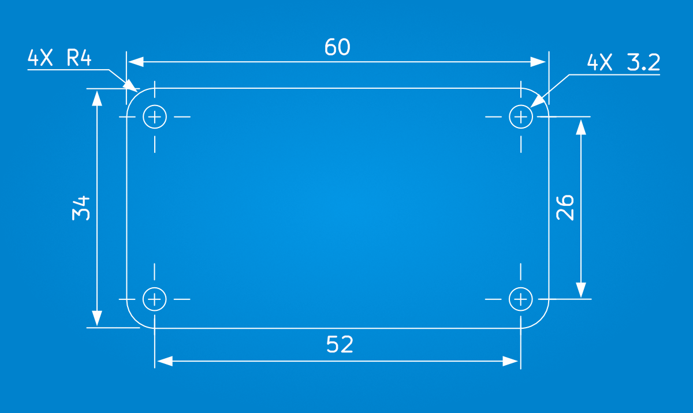
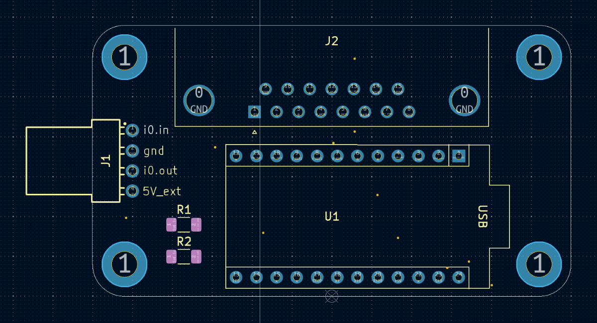
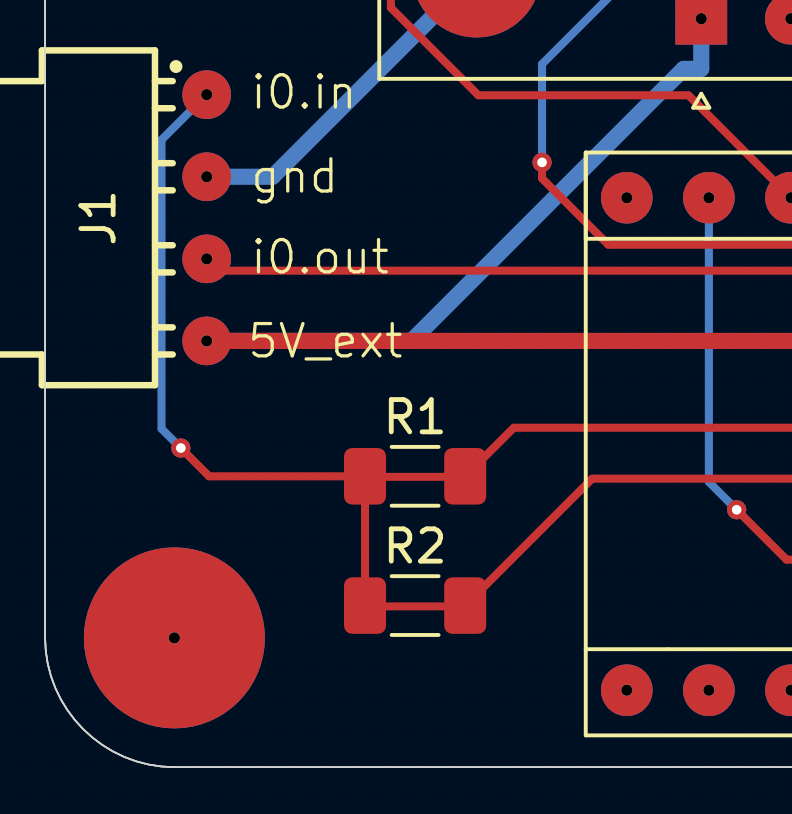
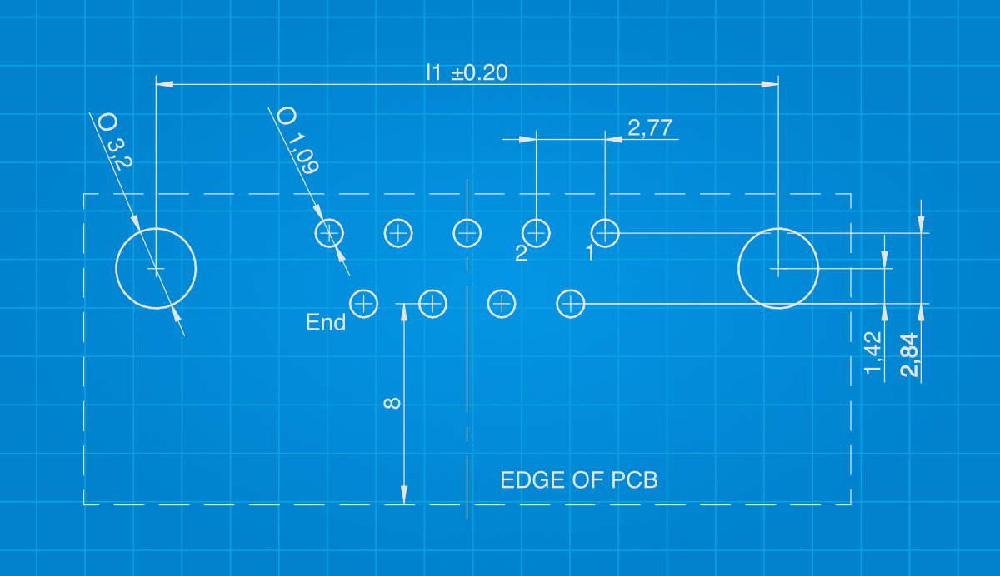

# CNC Pendant to Duet3D PCB



## Overview

The goal of the PCB is to simplify connection of a CNC pendant (assuming the pins match, of course), and to provide a disconnect at the control enclosure.

It follows the wiring diagram and instructions at [Duet3D CNC Pendant Documentation](https://docs.duet3d.com/User_manual/Connecting_hardware/IO_CNC_Pendant).

## Notes

1. Other pendants with a D-Sub connector may have different pin arrangements.
1. This PCB was tested with a Duet 3, but not with a Duet 2 nor a PanelDue.
1. There is a small change needed to the Arduino firmware. 
1. I don't know what I'm doing. Use at your own risk.

## Pendant

I have [this](https://www.aliexpress.com/item/32847286243.html) pendant from [Rattm Motor Store](https://www.aliexpress.com/store/907217) on Aliexpress (the listing says 4 axis but this one has a 5 axis switch).



### D-Sub pins

The image shows a female socket as you look at it:



GND, COM- and shield are all connected to ground on the PCB.

The connector pinout can be checked against the pads in the pendant.



## Mounting

The PCB can be mounted to the inside of an enclosure using the hex studs of the D‑sub connector. Alternatively, it could be mounted internally with an extension cable.

### Cutout



[DXF](./cad/panel_cutout.dxf)
[PDF](./cad/panel_cutout.pdf)

### Dimensions



## PCB components



| Reference | Description |
|---------- | ------- |
| U1 | Arduino Pro Micro |
| R1 | 1206 SMD 6K8 (6.8kΩ) resistor |
| R2 | 1206 SMD 10K (10kΩ) resistor |
| J1 | 1x4 2.54mm pitch male right-angle (optional) header |
| J2 | 15-pin D-Sub female right-angle (optional) connector with hex screws |

### Resistors (R1 & R2)

The resistors are optional when connecting to a Duet 3. If omitted, the pads of R1 should be bridged (see image).



### 1x4 header (J1)

The 1x4 pin, 2.54mm pitch, male header can be any make or type. A right-angle connector keeps the height low.

#### Vertical

e.g. [Würth Elektronik WR-WTB 61900411121](https://www.we-online.com/en/components/products/WTB_WR_WTB_2_54_MALE#61900411121)

#### Horizontal examples

e.g. [Würth Elektronik WR-WTB 61900411021](https://www.we-online.com/en/components/products/WTB_WR_WTB_2_54_MALE#61900411021).

or [Würth Elektronik WR-WTB 61900419521](https://www.we-online.com/en/components/products/WTB_WR_WTB_2_54_MALE#61900419521)

### D-Sub connector (J2)

e.g. [Würth Elektronik WR-DSUB PCB 618015231121](https://www.we-online.com/en/components/products/INPUT_OUTPUT_WR_DSUB_CONNECTORS_PCB#618015231121).



The mounting‑hole‑to‑board‑edge dimension appears to be a common one, so (cheaper) alternatives should be available.

## Connecting to Duet 2 or 3

See [Connector and spare part numbers](https://docs.duet3d.com/User_manual/Troubleshooting/Parts).

e.g. [Würth Elektronik WR-WTB 4-pin 61900411621](https://www.we-online.com/en/components/products/WTB_2_54_FEMALE_TERMINAL_HOUSING_6190XX11621#61900411621)

e.g. [Würth Elektronik WR-WTB 5-pin 61900511621](https://www.we-online.com/en/components/products/WTB_2_54_FEMALE_TERMINAL_HOUSING_6190XX11621#61900511621)

e.g. [Würth Elektronik WR-WTB female crimp 61900113722DEC](https://www.we-online.com/en/components/products/WTB_2_54_FEMALE_CRIMP_CONTACT_619X0113722#61900113722DEC)

## Firmware

In `CNC-pendant.ino`, change line 221 to:
```
distanceMultiplier = 1;
```

The reason for this is that there is no X1 pin (or signal) and the code is unable to detect that X1 is selected. Initialising `distanceMultiplier` to `1` instead of `0` solves that.

In addition, the firmware is unable to control the pendant's LED (i.e. turned off on emergency stop) as there is no LED+ signal.

## config.g

The Duet3D pendant document doesn't mention that serial communication needs to be enabled on io0 on Duet 3 e.g.:
```
; Accessories
M575 P1 S1 B57600 ; CNC pendant support
```
